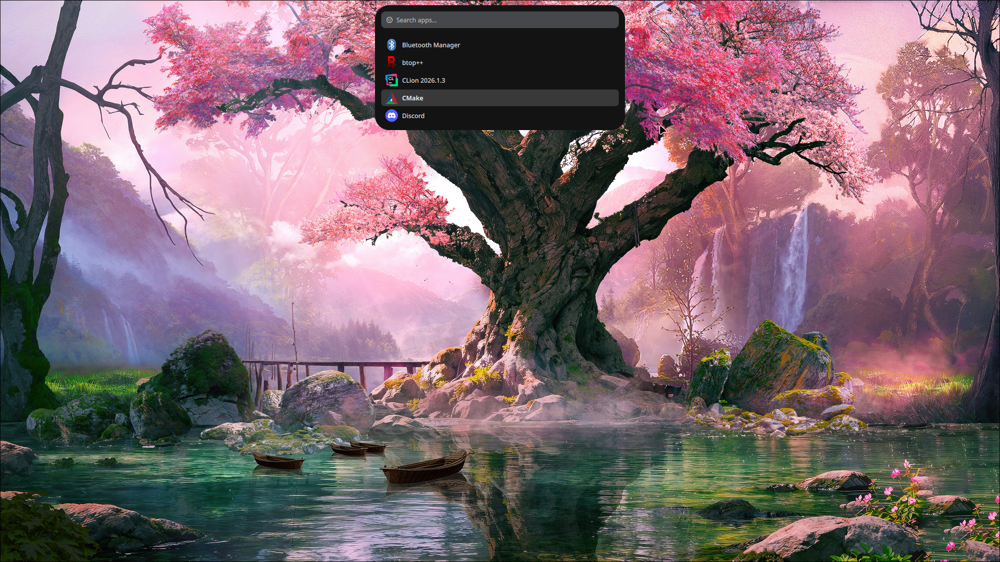
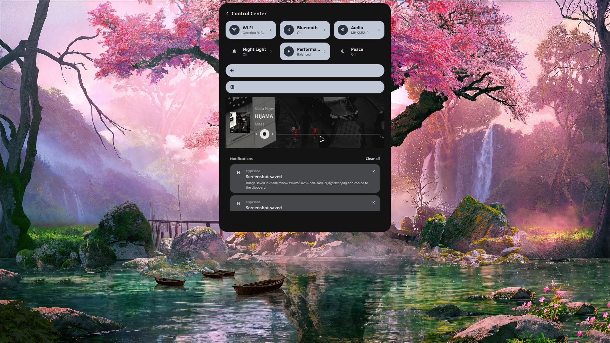
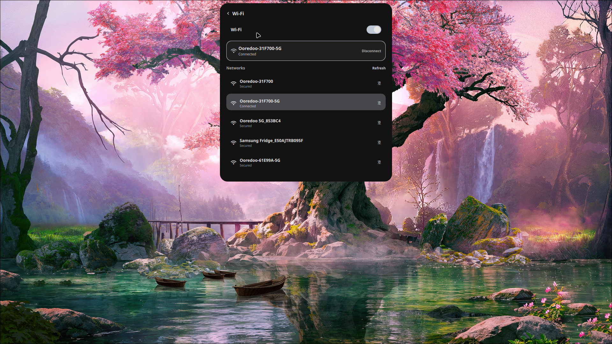
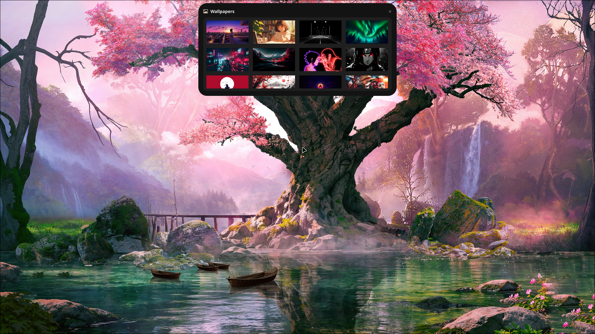

# quickshell-config

A feature-rich desktop shell configuration built with [Quickshell](https://quickshell.outfoxxed.me/), designed for Wayland compositors (Hyprland). Inspired by macOS Dynamic Island.


## Overview

This config transforms the top bar into a **Dynamic Island** — a compact, animated panel that expands on demand to reveal media controls, system status, notifications, and more. A full-featured **Control Center** overlay provides deep access to system settings.

```
shell.qml → PanelWindow (top bar) + ControlCenter (overlay)
```

## Features

### Dynamic Island (Clock Bar)

The top bar morphs between several states with elastic animations:

| State | Size | Content |
|---|---|---|
| **Collapsed** | 36px × auto | Clock + audio visualizer bars |
| **Expanded** | 64px × 540px | Media section (left), clock+date (center), status capsule (right) |
| **Morph overlay** | 130–240px | Volume/brightness/capslock/numlock/mode indicator (2s auto-revert) |
| **Notification** | 130px × 480px | App notification banner (3.5s auto-dismiss) |
| **Power Menu** | 130px × 480px | Logout · Lock · Sleep · Reboot · Shutdown buttons (10s auto-dismiss) |
| **App Launcher** | 240px × 480px | Search + filtered app grid (15s auto-dismiss) |
| **Askpass Dialog** | 200px × 480px | Sudo/SSH password prompt |

### Control Center

An overlay panel (540px wide) with subpage navigation:

- **Main dashboard** — audio volume, brightness, media player (MPRIS), recent notifications
- **WiFi** — scan, connect, disconnect, forget, password reveal, QR code sharing
- **Bluetooth** — device scan, pair, connect, disconnect, forget
- **Audio** — Pipewire sink/source selection and volume per device
- **Night Light** — gammastep manual temperature or auto (geoclue2 sunset/sunrise)
- **Performance Mode** — Silent / Balanced / Performance profiles with CPU temp monitoring

### Performance Modes

Three modes that adjust power profile, fan speed, and GPU:

| Mode | powerprofilesctl | nbfc (fan) | supergfxctl (GPU) |
|---|---|---|---|
| **Silent** | `power-saver` | 30% fixed | integrated |
| **Balanced** | `balanced` | auto | hybrid |
| **Performance** | `performance` | 90% fixed | hybrid |

A temperature watchdog polls CPU temp every 8 seconds and force-reverts to Balanced at ≥85°C.

### Media Integration

- **Cava audio visualizer** — 4-bar equalizer displayed inline
- **MPRIS support** — track info, album art, play/pause/next/prev via `playerctl` / `playerctld`
- **YouTube thumbnail extraction** — auto-detects YouTube URLs for cover art

### Notification System

- Integrates with `Quickshell.Services.Notifications.NotificationServer`
- Animated banners with app icon resolution, urgency coloring
- Notification history with clear-all support
- **Do Not Disturb** mode suppresses banners

### Askpass (sudo/SSH password prompts)

- Custom `SUDO_ASKPASS` and `SSH_ASKPASS` helpers using FIFO IPC
- Password dialog appears directly in the Dynamic Island
- Set `SUDO_ASKPASS` and `SSH_ASKPASS` environment variables (see [Setup](#setup))

### App Launcher

- Scans `.desktop` files from system, flatpak, and local directories
- Keyboard-navigable search with app icons
- Launches via `gtk-launch`

### Overview (Workspace Switcher)

- Full-screen workspace overview (like macOS Mission Control) — `qs -p overview.qml`
- Per-monitor layout with workspace thumbnails
- Glassmorphism effects, configurable grid
- Runs as a standalone process (zero idle memory), quits on Escape

### Movie & TV Finder

- Full-screen movie/TV search and streaming source finder — `qs -p movie.qml`
- Browse trending movies and TV shows, search by title
- Automatic source checking across multiple streaming providers
- Runs as a standalone process (zero idle memory), quits on Escape

### Wallpaper Picker

- Standalone wallpaper picker — `qs -p wallpaper-picker.qml`
- Scans `~/Pictures/Wallpapers/` for images
- Applies via `awww` (fallback: `feh`)
- Generates Material You color palette with `matugen` (live-updates the Theme singleton)
- Runs as a standalone process, quits on picking or Escape

## Architecture

```
shell.qml (main process)
├── NotificationService
├── PanelWindow (Dynamic Island + all overlays)
│   ├── DynamicIsland (clock, media, status, power menu, etc.)
│   ├── Search (app launcher)
│   ├── ControlCenter (audio, WiFi, Bluetooth, night light, mode)
│   └── IPC Process (polls $XDG_RUNTIME_DIR/qs-* trigger files)
├── AppLauncherService
├── ModeService (power/fan/GPU profiles + temp watchdog)
├── AskpassService

Standalone processes (zero idle memory, launched via qs -p):
├── overview.qml → Overview (workspace switcher, Super+Tab)
├── movie.qml → MovieWidget (movie/TV finder, Super+P)
└── wallpaper-picker.qml → WallpaperGrid + WallpaperService (Super+W)
```

### Project Structure

```
.
├── shell.qml                  # Entrypoint — main quickshell process
├── movie.qml                  # Standalone entrypoint — MovieWidget (qs -p)
├── overview.qml               # Standalone entrypoint — Overview (qs -p)
├── wallpaper-picker.qml       # Standalone entrypoint — WallpaperGrid (qs -p)
├── core/
│   ├── Theme.qml              # Singleton color palette (Material You)
│   ├── Fonts.qml              # Singleton fonts (Inter + JetBrainsMono Nerd Font)
│   ├── colors.json            # Matugen-generated Material You colors
│   └── colors.scss            # (reserved)
├── Widgets/
│   ├── clock/                 # Clock.qml wrapper + ClockWidget.qml (Dynamic Island)
│   ├── media/                 # MediaSection.qml + MediaService.qml (playerctl/cava)
│   ├── status/                # StatusCapsule.qml + StatusService.qml (WiFi/battery)
│   ├── cava/                  # CavaVisualizer.qml + cava.conf
│   ├── power/                 # PowerMenu.qml (Logout/Lock/Sleep/Reboot/Shutdown)
│   ├── notifications/        # NotificationService + Banners + History
│   ├── launcher/              # AppLauncher.qml + AppLauncherService.qml
│   ├── wallpaper/             # WallpaperOverlay + Grid + Service
│   ├── mode/                  # ModeService.qml (power/fan/GPU profiles)
│   └── askpass/               # AskpassService + PasswordAskpassDialog
├── controlCenter/
│   ├── ControlCenter.qml      # Main overlay panel (832 lines)
│   ├── components/            # ToggleTile, IconSlider, PageHeader, WifiPasswordDialog
│   └── pages/                 # MainPage, WifiPage, BluetoothPage, AudioPage, NightLightPage, ModePage
├── Overview/                  # Standalone overview module (workspace switcher)
├── scripts/
│   ├── wallpaper.sh           # Apply wallpaper + matugen color gen
│   ├── nightlight.sh          # gammastep wrapper (off/manual/auto)
│   ├── quickshell-askpass     # SUDO_ASKPASS helper (FIFO IPC)
│   └── quickshell-ssh-askpass # SSH_ASKPASS helper (FIFO IPC)
└── screenshots/               # Screenshots directory
```

## Dependencies

### Required

| Package | Purpose |
|---|---|
| [quickshell](https://quickshell.outfoxxed.me/) | QML shell runtime |
| `playerctl` + `playerctld` | MPRIS media player control |
| `cava` | Audio visualizer |
| `stdbuf` (coreutils) | Line-buffer cava output |
| `nmcli` (NetworkManager) | WiFi management |
| `brightnessctl` | Backlight control |
| `gammastep` | Night light / blue light filter |
| `powerprofilesctl` | Power profile switching |
| `nbfc` (NoteBook FanControl) | Fan speed control |
| `supergfxctl` | GPU mode switching (integrated/hybrid) |
| `hyprlock` | Screen locker |
| `gtk-launch` (glib) | Launch apps by desktop file ID |
| `qs` (quickshell CLI) | IPC for askpass |

### Optional

| Package | Purpose | Fallback |
|---|---|---|
| `awww` | Wallpaper setter | `feh --bg-fill` |
| `matugen` | Material You color generation | — |
| `qrencode` | WiFi QR code generation | — |
| `geoclue2` | Auto night light (sunset/sunrise) | Manual mode only |
| `iwgetid` | Fallback WiFi SSID detection | nmcli only |

### Fonts

- **Inter** — main UI font
- **JetBrainsMono Nerd Font** — monospace / icon glyphs (Nerd Font patched)

## Setup

### 1. Install Quickshell

Follow the [Quickshell installation guide](https://quickshell.outfoxxed.me/).

### 2. Clone the config

```sh
git clone https://github.com/YOUR_USER/quickshell-config ~/.config/quickshell
```

### 3. Install dependencies

<details>
<summary>Arch Linux</summary>

```sh
sudo pacman -S playerctl cava networkmanager brightnessctl gammastep power-profiles-daemon hyprlock glib2 coreutils
# AUR (replace yay with your AUR helper)
yay -S nbfc supergfxctl matugen awww quickshell
```
</details>

<details>
<summary>NixOS</summary>

```nix
{ pkgs, ... }: {
  environment.systemPackages = with pkgs; [
    quickshell playerctl cava networkmanager brightnessctl
    gammastep power-profiles-daemon hyprlock glib
    nbfc supergfxctl matugen feh
    coreutils
  ];
}
```
Or with `nix-shell`:
```sh
nix-shell -p quickshell playerctl cava networkmanager brightnessctl gammastep power-profiles-daemon hyprlock glib nbfc supergfxctl matugen feh coreutils
```
</details>

<details>
<summary>Fedora</summary>

```sh
sudo dnf install playerctl cava NetworkManager brightnessctl gammastep power-profiles-daemon hyprlock glib2 coreutils
# COPR or manual build for quickshell, nbfc, supergfxctl, matugen
```
</details>

<details>
<summary>openSUSE</summary>

```sh
sudo zypper install playerctl cava NetworkManager brightnessctl gammastep power-profiles-daemon hyprlock glib2 coreutils
# OBS or manual build for quickshell, nbfc, supergfxctl, matugen
```
</details>

<details>
<summary>Void Linux</summary>

```sh
sudo xbps-install playerctl cava NetworkManager brightnessctl gammastep power-profiles-daemon hyprlock glib coreutils
# quickshell available in void-packages
```
</details>

<details>
<summary>Alpine Linux</summary>

```sh
sudo apk add playerctl cava networkmanager brightnessctl gammastep power-profiles-daemon hyprlock glib coreutils
# quickshell available in community repo
```
</details>

<details>
<summary>Gentoo</summary>

```sh
sudo emerge --ask media-sound/playerctl media-sound/cava net-misc/networkmanager
# + brightnessctl, gammastep, power-profiles-daemon, hyprlock, glib
# quickshell available in GURU overlay
```
</details>

<details>
<summary>Ubuntu / Debian</summary>

Quickshell requires a manual build from source. Dependencies via apt:

```sh
sudo apt install playerctl cava network-manager brightnessctl gammastep power-profiles-daemon hyprlock libglib2.0-bin coreutils
# quickshell, nbfc, supergfxctl, matugen — build from source
```
</details>

### 4. Start quickshell

```sh
quickshell
```

### 5. (Optional) Askpass setup

Add to your shell config (`~/.zshrc` / `~/.bashrc`):

```sh
export SUDO_ASKPASS="$HOME/.config/quickshell/scripts/quickshell-askpass"
alias sudo='sudo -A'

export SSH_ASKPASS="$HOME/.config/quickshell/scripts/quickshell-ssh-askpass"
export SSH_ASKPASS_REQUIRE=force
```

### 6. (Optional) Keyboard shortcuts

The main process watches for trigger files in `$XDG_RUNTIME_DIR` (defaults to `/tmp/runtime-$USER`):

| File | Action | Keybind |
|---|---|---|
| `qs-power-menu` (write `p`) | Toggle power menu | `$mod+Q` |
| `qs-app-launcher` (write `a`) | Toggle app launcher | `$mod+Space` |
| `qs-mode-cycle` (write `m`) | Cycle silent → balanced → performance | `$mod+M` |
| `qs-toggle-cc` (write `c`) | Toggle control center | `$mod+C` |

Standalone launchers (separate `qs` process, zero idle memory):

| Entrypoint | Action | Keybind |
|---|---|---|
| `qs -p overview.qml` | Workspace overview | `$mod+Tab` |
| `qs -p movie.qml` | Movie/TV finder | `$mod+P` |
| `qs -p wallpaper-picker.qml` | Wallpaper picker | `$mod+W` |

Hyprland keybinds:

```conf
# IPC flags — $XDG_RUNTIME_DIR is typically /run/user/$UID
bind = $mod, Q, exec, echo p > $XDG_RUNTIME_DIR/qs-power-menu
bind = $mod, Space, exec, echo a > $XDG_RUNTIME_DIR/qs-app-launcher
bind = $mod, M, exec, echo m > $XDG_RUNTIME_DIR/qs-mode-cycle
bind = $mod, C, exec, echo c > $XDG_RUNTIME_DIR/qs-toggle-cc
# Standalone processes
bind = $mod, Tab, exec, qs -p ~/.config/quickshell/overview.qml
bind = $mod, P, exec, qs -p ~/.config/quickshell/movie.qml
bind = $mod, W, exec, qs -p ~/.config/quickshell/wallpaper-picker.qml
```

Built-in: `Alt+Q` (power menu) and `Alt+F5` (mode cycle) using Qt `ApplicationShortcut`.

### 7. (Optional) Wallpaper directory

Place wallpaper images in `~/Pictures/Wallpapers/` (supports jpg, jpeg, png, bmp, webp, gif).

### 8. (Optional) Matugen auto-color

Configure `~/.config/matugen/config.toml` to output to `core/colors.json` for live Material You color generation on wallpaper change.

### 9. System files this config reads

| Path | Purpose |
|---|---|
| `/sys/class/power_supply/BAT*/capacity` | Battery percentage |
| `/sys/class/power_supply/BAT*/status` | Charging status |
| `/sys/class/backlight/*/brightness` | Brightness level |
| `/sys/class/backlight/*/max_brightness` | Max brightness |
| `/sys/class/leds/*capslock*/brightness` | Caps Lock state |
| `/sys/class/leds/*numlock*/brightness` | Num Lock state |
| `/sys/class/hwmon/hwmon*/temp1_input` | CPU temperature (k10temp preferred) |
| `/proc/net/wireless` | WiFi signal strength |

## Screenshots

> Place screenshots in the `screenshots/` directory and reference them here.

| Preview | Description |
|---|---|
|  | Collapsed Dynamic Island (default) |
|  | Expanded view with media, clock, status |
|  | Power menu overlay |
|  | App launcher with search |
|  | Control Center main page |
|  | WiFi scan and connect |
|  | Bluetooth device management |
|  | Notification banner |
|  | Wallpaper selection grid |

## Styling

- **2-space indentation**, no comments
- **Nerd Font** icon glyphs used inline (e.g. `"󰥔"`, `"󰕾"`)
- `TextureFont` for icon rendering
- Material You color palette generated by `matugen` — live-updates via `FileView` on `core/colors.json`
- `Easing.OutBack` (450ms) for elastic island morph animations
- All colors, radii, and fonts centralized in `core/` singletons

## Licensing

This project is a personal configuration. Feel free to fork, modify, and adapt.
